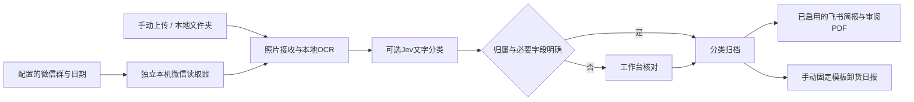

# 项目后勤与报销工作台：项目状态报告

资料日期：2026-09-29。本文用于理解仓库、讨论产品方向和接续开发；不包含本地业务数据库、照片、账号配置或用户日报。运行数据另存本地私有快照。

## 当前结论

项目已从票据排版工具扩展为 Windows 本地项目工作台，具备报销材料整理、现场照片归档、临时/定时任务、飞书照片简报及固定模板卸货日报。它仍是依赖本地电脑和外部配置的项目工具，尚未成为只在飞书内操作即可完成全部工作的产品。

建议产品主线保持为“配置来源 → 自动整理 → 收到简报 → 核对少量问题 → 导出报告”。电脑工作台承担核对和维护，飞书承担结果通知及将来的轻量入口。后台消息收件箱不应被误解为实时聚合所有微信群聊天。

## 功能状态

| 模块 | 仓库已实现 | 当前限制 |
| --- | --- | --- |
| 发票与报销 | 本地OCR、事项/附件管理、材料核对、分类建议与缓存、票据唯一配对、PDF/MD/XLSX导出、HTML审阅 | 需人工核对；Excel需私有模板和额外Node运行依赖；不是财务系统提交接口 |
| 项目与待办 | 项目隔离、来源群配置、临时任务、每日照片任务、删除/撤销、暂停/启用 | 定时任务随本机后端运行，不唤醒关机电脑 |
| 现场照片 | 上传、递归目录读取、指定微信群和日期读取、本地OCR、可选Jev文字分类、原字节归档、质量标记 | 微信读取器需另配；未缓存图片不会自动下载；原图与普通缓存尚无跨版本合并 |
| 飞书照片简报 | 本人账号绑定、按项目开关、简报和三列照片审阅PDF、去重与失败重试 | 不等于飞书内完整工作台；手机不能打开电脑localhost |
| 卸货日报 | 已确认模板的有限字段和照片替换、本机PowerPoint检查、HTML/PPTX交付 | 手动触发；需要Windows、PowerPoint和项目私有模板 |
| 通用施工日报/结算 | 可复用照片与既有模板基础设施 | 通用生成、阶段内容选择和每日自动交付尚未接入工作台 |
| 人员打卡 | 照片管理可保存人员类资料 | 上班/下班/加班、班次和岗位核对尚无通用考勤模块；不通过人脸确定身份 |
| 普通聊天收件箱 | 显式会话读取适配器、去重、归属与辅助消息界面 | 普通消息的常驻采集未接通，不等于照片读取链路 |

## 数据流与运行边界

- 默认本机运行。OCR和PDF处理在本地；开启Jev时会发送约定范围的提取文字及分类上下文，不发送原照片。开启飞书照片附件时，审阅PDF及其中照片会经过飞书。
- 消息发送日期用于限定采集窗口；照片水印日期用于拍摄日期与阶段判断，二者分开。
- 共用群不能整体归属于某项目，外地工厂照片需结合运输关联，不直接按城市排除。
- 照片数量不证明完成比例；照片拍摄时间不直接等于净工作时长；重复照片不累加出勤人数。
- 模板是用户资料，不随源码发布。通用PPT解析通过不代替PowerPoint原生打开检查。

## 代码入口

| 责任 | 主要入口 |
| --- | --- |
| HTTP页面与API | `workbench_web.py`、`web/` |
| 报销台账与核对 | `workbench.py`、`intake_queue.py`、`expense_review.py` |
| 自动费用整理 | `automatic_category.py`、`automatic_rides.py`、`expense_preferences.py` |
| 报销审阅与导出 | `report_snapshot.py`、`reimbursement.py`、`report_excel.py`、`report_xlsx.mjs` |
| 项目与待办 | `logistics.py`、`project_todos.py` |
| 照片与调度 | `site_photos.py`、`photo_classifier.py`、`photo_wechat_bridge.py`、`photo_schedule.py` |
| 飞书照片简报 | `photo_briefs.py`、`photo_review_pdf.py`、`feishu_bot.py` |
| 固定模板日报 | `daily_reports.py`、`daily_report_render.ps1` |
| 运行身份与启动 | `workbench_runtime.py`、`scripts/start-workbench.ps1` |

Python文件均位于 `src/invoice_print_layout/`。详细契约见[工作台](workbench.md)、[照片管理](photo-management.md)、[照片简报](photo-briefs.md)、[固定模板日报](daily-reports.md)。

## 本次验证

- 完整pytest：576通过、1跳过。跳过项是需要本地私有模板的Excel集成测试；另有2条第三方SDK弃用警告。
- mypy：50个源码文件通过。
- 浏览器回归：照片页真实本地HTTP流程（合成照片、模拟OCR/Jev/发送）及项目/待办页模拟接口回归通过，涵盖分类保存、提示消失、任务进度、隔离与移动布局。
- 本次仅修订公开说明、忽略规则与合成样例，未改变业务运行逻辑。测试显式设置当前仓库的 `PYTHONPATH=src`，避免虚拟环境的可编辑安装指向另一份checkout。
- 提交候选已检查私有工作区/媒体文件排除，以及已知身份、路径和凭据模式；这不是完整安全审计。

合成单元/接口测试与真实微信、飞书、PowerPoint端到端检查是不同层次。本轮未重新登录外部服务、未发送消息、未新建报告或改动生产台账；测试通过不表示所有外部集成都已稳定运行。

## 下一阶段建议

1. 先建立可核对的照片任务完成标准：新增、重复、待核对、缓存缺失和读取失败分别展示；失败能补读，补读不重复归档或推送。
2. 将人工制作施工日报的流程产品化：模板按阶段选择、收工照片批次选择、日期与累计工时确认、PPT与三列审阅一起交付；不从旧报告复制未经确认的当天事实。
3. 人员打卡采用水印、明确岗位标签和班次记录；迟拍、错峰班、加班分别处理，不用固定17:30截点替代实际班次。
4. 再做飞书内添加来源群和待核对入口，先解决跨设备访问与绑定，再调整前台导航。消息收件和识别配置可退到维护入口。

## 获取和复现

按根目录README安装Python依赖，运行本机工作台。外部接口凭据、微信读取器、Office模板、PowerPoint和Excel渲染依赖需分别配置。公开仓库只含源码、文档和合成测试；克隆仓库不会恢复用户业务工作区。未制作安装包，未新增云部署。
